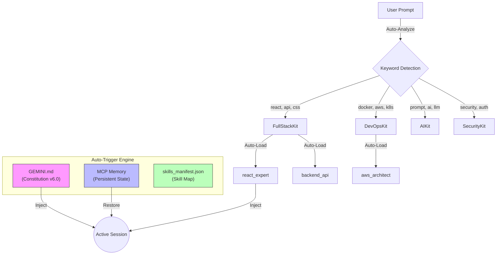

# Agentic Work System v6.0

[](./README.tr.md)
[](LICENSE)
[]()

> **"If it's not written, it doesn't exist."** — *The Anti-Phantom Rule*

This repository contains a complete **Operating System for Agents**, designed to standardize advanced agentic coding workflows. It enables AI models to maintain context, follow strict protocols, and utilize a vast library of specialized skills during pair-programming sessions.

## ✨ What's New in v6.0

- 🚀 **Auto-Trigger System** - No manual initialization needed
- 🧠 **MCP Memory Integration** - Persistent state across sessions
- 📦 **Smart Kit Selection** - Automatic skill loading based on keywords
- ⚡ **Zero-Config Start** - Just prompt, system handles the rest

---

## 🏗️ System Architecture

The system operates on a **"Context Injection"** model with **automatic triggering**. The AI loads specific rules and skills based on keywords in your prompt.



---

## 🚀 Usage

### Quick Start (v6.0 - Auto-Trigger)

Simply start prompting. **No initialization command needed!**

```
You: "Create a React dashboard with user authentication"
```

The AI will automatically:
1. ✅ Check MCP Memory for session state
2. ✅ Detect keywords: `react`, `auth` → Select `FullStackKit` + `SecurityKit`
3. ✅ Load skills: `react_expert`, `auth_patterns`
4. ✅ Start working

### Keyword Triggers

| Keywords | Kit Selected | Skills Loaded |
|----------|--------------|---------------|
| react, css, database, api, sql | FullStackKit | react_expert, backend_api, database_design |
| docker, aws, kubernetes, terraform | DevOpsKit | aws_architect, docker_optimization |
| prompt, ai, llm, rag, agent | AIKit | prompt_engineering, rag_architecture |
| security, auth, vuln, login | SecurityKit | secops_core, auth_patterns |
| plan, agile, scrum, docs | ManagementKit | project_management, docs_readme |

---

## 📁 Repository Structure

```
antigravity-agentic-skills/
├── config/
│   └── skills_manifest.json    # Kit definitions & skill mappings
├── rules/
│   └── GEMINI.md               # Constitution v6.0 (Auto-Trigger + MCP Memory)
├── skills/                      # 138+ skill modules
│   ├── react_expert/
│   ├── backend_api/
│   ├── aws_architect/
│   └── ...
└── workflows/
    └── protokol_uygulama.md    # Legacy workflow (optional)
```

---

## 🛠️ Installation

1. Clone the repository
2. Copy contents to your local `.skillport` directory:
   - Windows: `%USERPROFILE%\.skillport\`
   - macOS/Linux: `~/.skillport/`
3. Copy `rules/GEMINI.md` to your AI assistant's global rules
4. Configure MCP Memory server (optional but recommended)

---

## 📚 Skills Library (138+ Skills)

### 🌐 FullStackKit
* **Target:** Web & Mobile, Databases, APIs
* **Key Skills:** `react_expert`, `backend_api`, `database_design`, `python_pro`, `typescript_advanced`

### ☁️ DevOpsKit
* **Target:** Infrastructure, Cloud, CI/CD
* **Key Skills:** `aws_architect`, `docker_optimization`, `kubernetes_specialist`, `terraform_engineer`

### 🤖 AIKit
* **Target:** LLM Integration, RAG, Agents
* **Key Skills:** `prompt_engineering`, `rag_architecture`, `agent_orchestration`, `langchain_patterns`

### 🛡️ SecurityKit
* **Target:** Audits, Penetration Testing
* **Key Skills:** `secops_core`, `auth_patterns`, `better_auth`

### 📋 ManagementKit
* **Target:** Documentation, Agile, Planning
* **Key Skills:** `docs_readme`, `project_management`, `scrum_master`

---

## 📜 License

This project is licensed under the MIT License - see the [LICENSE](LICENSE) file for details.
