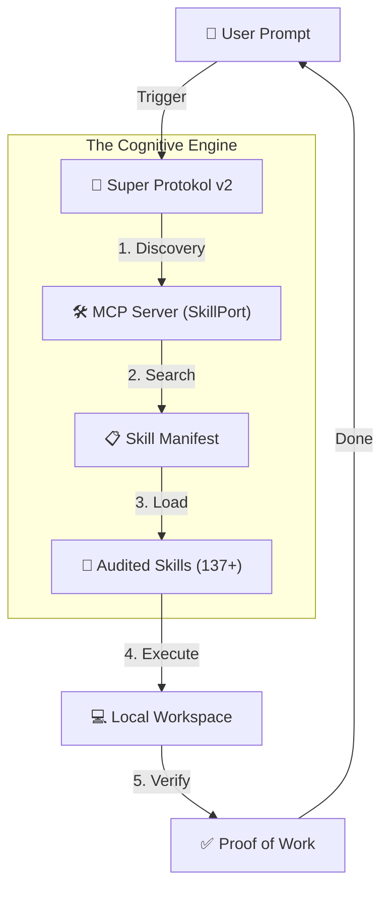
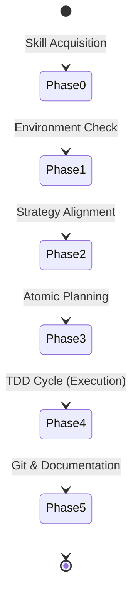

# 🌌 Antigravity Agentic Skills
### The Operating System for Autonomous Agents (2026 Edition)

[]()
[]()
[]()

---

## 🌍 Language Options / Dil Seçenekleri
- [English Documentation](#-english-documentation)
- [Türkçe Dokümantasyon](#-türkçe-dokümantasyon)

---

## 🇬🇧 English Documentation

**Antigravity** is a **Cognitive Architecture** project designed to transform AI agents (Claude Code, Gemini, etc.) from amnesic chat bots into specialized agents with long-term memory, deep expertise, and engineering discipline.

### 🧠 System Architecture


### 📡 The Protocol: `@/super_protokol_v2`
The agent follows this lifecycle to ensure engineering discipline in every message:


### 📂 Directory Structure
```text
antigravity-agentic-skills/
├── 🧠 skills/               # Knowledge Base (137+ Expertises)
│   ├── react_expert/        # Skill Folder
│   │   ├── SKILL.md         # Strategy & Workflow (Evidence-Based)
│   │   ├── scripts/         # Automation Scripts (Execution)
│   │   └── references/      # Deep Knowledge Docs (Knowledge)
│   └── [136 other skills...]
├── 📡 workflows/            # OS Layer (Protocols)
├── 📜 GEMINI.md             # Global Rules & Memory
└── 📋 skills_manifest.json  # Central Routing & Metadata
```

---

## 🇹🇷 Türkçe Dokümantasyon

**Antigravity**, AI ajanlarını (Claude Code, Gemini vb.) amnezik birer sohbet botundan öteye taşıyan, onlara uzun vadeli hafıza, uzmanlık ve mühendislik disiplini kazandıran bir **Bilişsel Mimari (Cognitive Architecture)** projesidir.

### 🧠 Sistem Mimarisi
(Yukarıdaki şema ile aynı mimariyi izler: Kullanıcı -> Protokol -> SkillPort -> 137+ Denetlenmiş Yetenek)

### 📡 Protokol: `@/super_protokol_v2`
Ajanın her mesajda izlediği, mühendislik disiplinini garantiye alan yaşam döngüsü yukarıdaki Mermaid şemasında (Phase 0 - Phase 5) belirtilmiştir. Özellikle **Phase 4 (TDD)**, "Test yoksa kod yazma" kuralını dayatır.

### 📂 Dosya Yapısı ve Hiyerarşi
```text
antigravity-agentic-skills/
├── 🧠 skills/               # Bilgi Bankası (137+ Uzmanlık)
│   ├── react_expert/        # Skill Klasörü
│   │   ├── SKILL.md         # Strateji ve Workflow (Kanıta Dayalı)
│   │   ├── scripts/         # Otomasyon Betikleri (Eylem)
│   │   └── references/      # Derin Uzmanlık Dökümanları (Bilgi)
├── 📡 workflows/            # İşletim Sistemi Katmanı
├── 📜 GEMINI.md             # Global Kurallar ve Hafıza
└── 📋 skills_manifest.json  # Merkezi Yönlendirme
```

---

## 🛡️ Privacy & Security (Security First)
The system is fully anonymized. All paths and commands rely on generic structures (e.g., `<USER>`, `~/.skillport/`). No personal data is stored.
*Sistem tamamen anonimleştirilmiştir. Tüm yollar ve komutlar jenerik yapılara dayanır. Kişisel veri barındırmaz.*

---

## 🛠️ Installation / Kurulum
1. Install **SkillPort MCP**: [SkillPort Repo](https://github.com/xenitV1/skillport)
2. Clone this repo: `git clone https://github.com/vuralserhat86/antigravity-agentic-skills.git ~/.skillport/skills`
3. Whisper to your Agent / Ajanınıza fısıldayın: `@/super_protokol_v2`

---
Built with **Zero-Tolerance Discipline** for the future of **Autonomous Engineering**.
