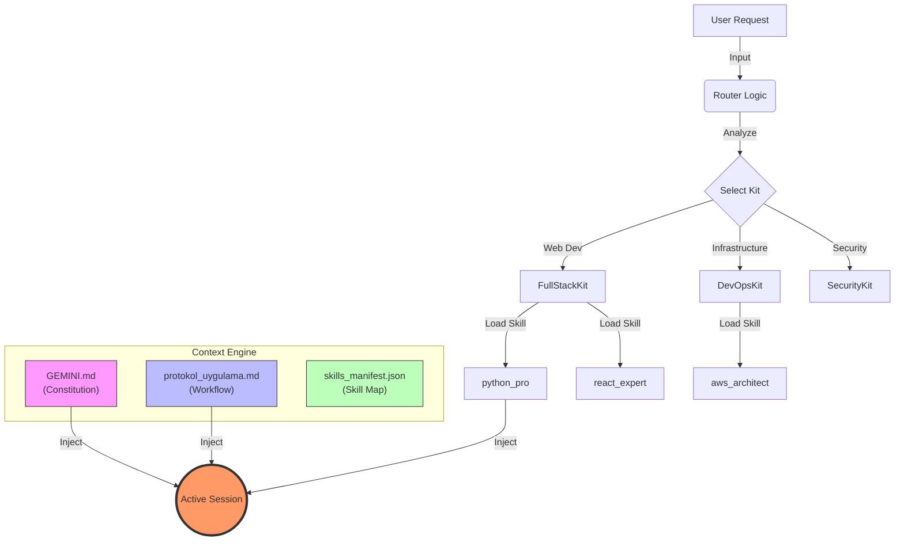
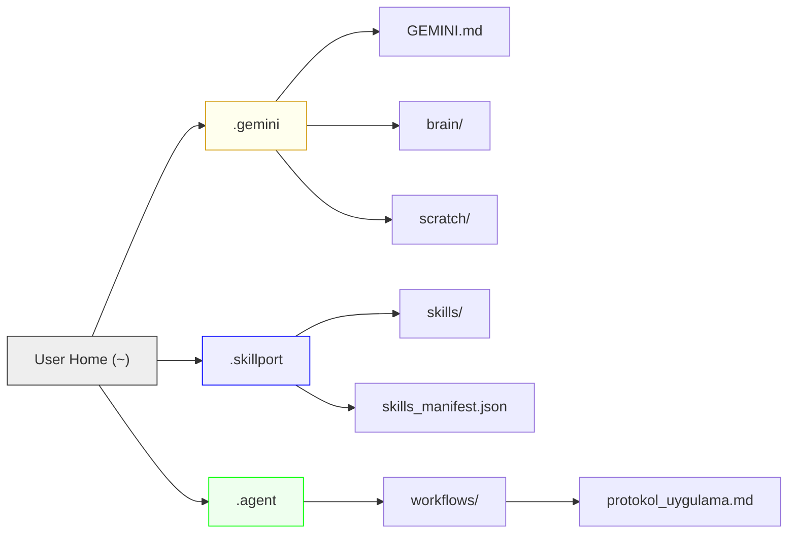

# Agentic Work System

[](./README.tr.md)
[](LICENSE)

> **"If it's not written, it doesn't exist."** — *The Anti-Phantom Rule*

This repository contains a complete **Operating System for Agents**, designed to standardize advanced agentic coding workflows. It enables AI models to maintain context, follow strict protocols, and utilize a vast library of specialized skills during pair-programming sessions.

---

## 🏗️ System Architecture

The system operates on a "Context Injection" model, where the AI loads specific rules and skills based on the active task.



## 📂 Directory Structure



---

## 🛠️ Prerequisites

To fully utilize this system, ensure your environment is set up with the following tools:

| Tool | Version | Required For | Link |
|------|---------|--------------|------|
| **Python** | 3.11+ | Running scripts & backend skills | [Download](https://www.python.org/downloads/) |
| **Node.js** | 20+ | Web development skills | [Download](https://nodejs.org/) |
| **Git** | Latest | Version control | [Download](https://git-scm.com/downloads) |
| **VS Code** | Latest | Recommended Editor | [Download](https://code.visualstudio.com/) |

---

## ⚙️ Installation (Skillpot - The Engine)

This system uses **Skillport** to manage and serve agent skills. You can install it via `uvx` (Zero Install) or `pip`.

### Option A: Zero Install (Recommended)
Requires [uv](https://docs.astral.sh/uv/getting-started/installation/) installed.

Add this to your MCP settings (VS Code / Claude / Cursor):
```json
{
  "mcpServers": {
    "skillport": {
      "command": "uvx",
      "args": [
        "--from", "git+https://github.com/xenitV1/skillport",
        "skillport"
      ]
    }
  }
}
```

### Option B: Permanent Install (Pip)
```bash
pip install git+https://github.com/xenitV1/skillport.git
```
MCP Config:
```json
{
  "mcpServers": {
    "skillport": {
      "command": "skillport",
      "args": []
    }
  }
}
```

### 🧠 Register Antigravity Skills (The Brain)
To load the skills provided in this repository, run:

```bash
# If using uvx
uvx --from git+https://github.com/xenitV1/skillport skillport add https://github.com/xenitV1/skillport/tree/main/.agent/skills

# If installed via pip
python -m skillport add https://github.com/xenitV1/skillport/tree/main/.agent/skills
```

---

## 🏗️ System Setup (Local Protocols)

Follow these steps to set up the configuration files (Rules & Workflows) on your local machine.

### 1. Create Data Directories
The system relies on specific folder paths in your user home directory.
```bash
# Windows Powershell
New-Item -ItemType Directory -Force -Path "$HOME\.gemini"
New-Item -ItemType Directory -Force -Path "$HOME\.skillport\skills"
New-Item -ItemType Directory -Force -Path "$HOME\.agent\workflows"
```

### 2. Copy Configuration Files
Move the files from this repository to their respective locations:

1.  **Constitution:**
    *   `rules/GEMINI.md` ➡️ `~/.gemini/GEMINI.md`
2.  **Skill Manifest:**
    *   `config/skills_manifest.json` ➡️ `~/.skillport/skills_manifest.json`
3.  **Workflow Protocol:**
    *   `workflows/protokol_uygulama.md` ➡️ `~/.agent/workflows/protokol_uygulama.md`

### 3. Install Skills
Copy the entire contents of the `skills/` folder to your local skillport directory.
*   `skills/*` ➡️ `~/.skillport/skills/`

> **Note:** The `skills_manifest.json` path in the config might need to be adjusted if you are not using Windows. It is pre-configured for `%USER_PROFILE%`.

---

## 📚 Skills Library (Managed via Skillport)

The system comes with **130+ specialized skills** grouped into "Kits". Here are the main categories:

### 🌐 FullStackKit
*   **Target:** Web & Mobile, Databases, APIs.
*   **Key Skills:** `react_expert`, `backend_api`, `database_design`, `python_pro`, `typescript_advanced`.

### ☁️ DevOpsKit
*   **Target:** Infrastructure, Cloud, CI/CD.
*   **Key Skills:** `aws_architect`, `docker_optimization`, `kubernetes_specialist`, `terraform_engineer`, `deploy_cicd`.

### 🤖 AIKit
*   **Target:** LLM Integration, RAG, Agents.
*   **Key Skills:** `prompt_engineering`, `rag_architecture`, `agent_orchestration`, `langchain_patterns`.

### 🛡️ SecurityKit
*   **Target:** Audits, Penetration Testing.
*   **Key Skills:** `secops_core`, `auth_patterns`, `better_auth`.

### 📋 ManagementKit
*   **Target:** Documentation, Agile, Planning.
*   **Key Skills:** `docs_readme`, `project_management`, `scrum_master`.

---

## 🚀 Usage

Once installed, simply instruct your AI assistant (e.g., in Cursor, Windsurf, or a CLI agent) to initialize the system:

> "Initialize the system and execute the protocol_uygulama workflow."

The AI will:
1.  Read `GEMINI.md` to understand its persona and rules.
2.  Read `skills_manifest.json` to see available tools.
3.  Load the necessary skills for your specific request.

---

## 📜 License

This project is licensed under the MIT License - see the [LICENSE](LICENSE) file for details.
