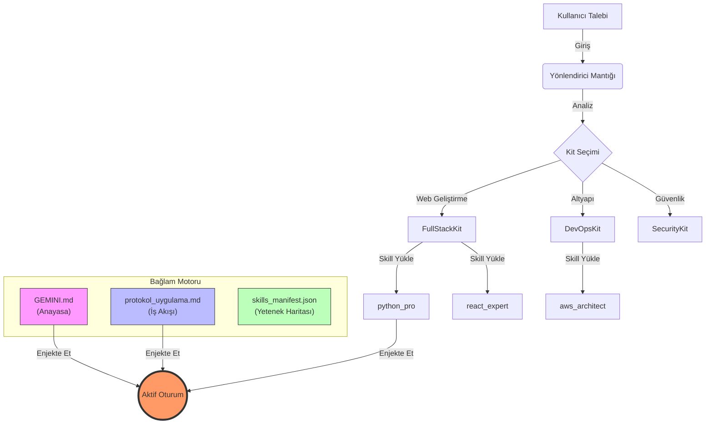
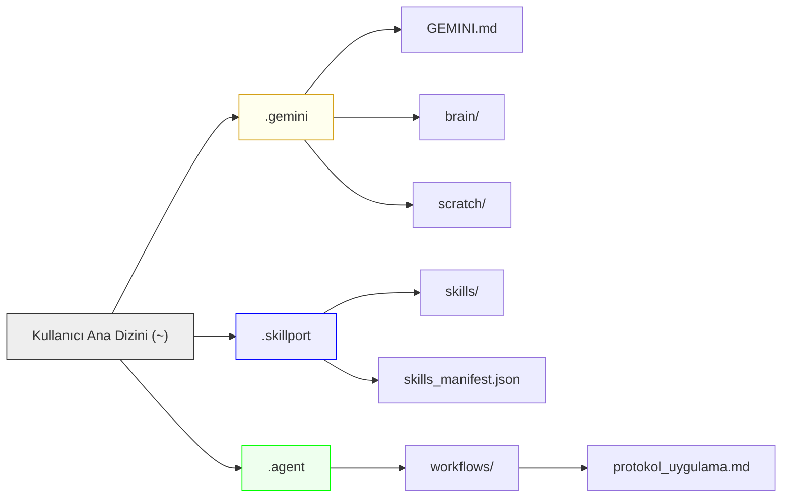

# Agentic Work System

[](./README.md)
[](LICENSE)

> **"Yazılı değilse, yoktur."** — *The Anti-Phantom Rule*

Bu depo, gelişmiş "Agentic Coding" (Otonom Kodlama) süreçlerini standartlaştırmak için tasarlanmış eksiksiz bir **Ajan İşletim Sistemi** (Operating System for Agents) içerir. Yapay zeka modellerinin bağlamı (context) korumasını, sıkı protokollere uymasını ve pair-programming sırasında geniş bir yetenek kütüphanesini kullanmasını sağlar.

---

## 🏗️ Sistem Mimarisi

Sistem, "Context Injection" (Bağlam Enjeksiyonu) modeliyle çalışır. AI, aktif göreve bağlı olarak belirli kuralları ve yetenekleri dinamik olarak yükler.



## 📂 Klasör Yapısı



---

## 🛠️ Gereksinimler

Sistemi tam kapasiteyle kullanabilmek için ortamınızda aşağıdaki araçların kurulu olduğundan emin olun:

| Araç | Versiyon | Ne İçin Gerekli? | Link |
|------|----------|------------------|------|
| **Python** | 3.11+ | Betikleri ve backend skill'lerini çalıştırmak için | [İndir](https://www.python.org/downloads/) |
| **Node.js** | 20+ | Web geliştirme skill'leri için | [İndir](https://nodejs.org/) |
| **Git** | Son Sürüm | Versiyon kontrolü için | [İndir](https://git-scm.com/downloads) |
| **VS Code** | Son Sürüm | Önerilen Editör | [İndir](https://code.visualstudio.com/) |

---

## ⚙️ Kurulum (Skillport - Motor)

Bu sistem, yetenekleri yönetmek ve sunmak için **Skillport** kullanır. `uvx` (Kurulumsuz) veya `pip` aracılığıyla kurabilirsiniz.

### Seçenek A: Kurulumsuz (Önerilen)
[uv](https://docs.astral.sh/uv/getting-started/installation/) aracının yüklü olmasını gerektirir.

MCP ayarlarınıza (VS Code / Claude / Cursor) şunu ekleyin:
```json
{
  "mcpServers": {
    "skillport": {
      "command": "uvx",
      "args": [
        "--from", "git+https://github.com/xenitV1/skillport",
        "skillport"
      ]
    }
  }
}
```

### Seçenek B: Kalıcı Kurulum (Pip)
```bash
pip install git+https://github.com/xenitV1/skillport.git
```
MCP Yapılandırması:
```json
{
  "mcpServers": {
    "skillport": {
      "command": "skillport",
      "args": []
    }
  }
}
```

### 🧠 Antigravity Yeteneklerini Kaydet (Beyin)
Bu depoda sunulan yetenekleri yüklemek için şu komutu çalıştırın:

```bash
# uvx kullanıyorsanız
uvx --from git+https://github.com/xenitV1/skillport skillport add https://github.com/xenitV1/skillport/tree/main/.agent/skills

# pip ile yüklediyseniz
python -m skillport add https://github.com/xenitV1/skillport/tree/main/.agent/skills
```

---

## 🏗️ Sistem Kurulumu (Yerel Protokoller)

Kuralları ve İş Akışlarını yerel makinenize kurmak için aşağıdaki adımları izleyin.

### 1. Veri Klasörlerini Oluşturun
Sistem, kullanıcı ana dizininizde belirli klasör yollarına ihtiyaç duyar.
```bash
# Windows Powershell
New-Item -ItemType Directory -Force -Path "$HOME\.gemini"
New-Item -ItemType Directory -Force -Path "$HOME\.skillport\skills"
New-Item -ItemType Directory -Force -Path "$HOME\.agent\workflows"
```

### 2. Konfigürasyon Dosyalarını Kopyalayın
Bu repodaki dosyaları ilgili yerlerine taşıyın:

1.  **Anayasa (Constitution):**
    *   `rules/GEMINI.md` ➡️ `~/.gemini/GEMINI.md`
2.  **Yetenek Manifestosu:**
    *   `config/skills_manifest.json` ➡️ `~/.skillport/skills_manifest.json`
3.  **İş Akışı Protokolü:**
    *   `workflows/protokol_uygulama.md` ➡️ `~/.agent/workflows/protokol_uygulama.md`

### 3. Skill'leri Yükleyin
`skills/` klasörünün tüm içeriğini yerel skillport dizininize kopyalayın.
*   `skills/*` ➡️ `~/.skillport/skills/`

> **Not:** Windows kullanmıyorsanız, `skills_manifest.json` içindeki yolları ayarlamanız gerekebilir. Varsayılan olarak `%USER_PROFILE%` için yapılandırılmıştır.

---

## 📚 Yetenek Kütüphanesi (Skillport)

Sistem, "Kit"ler halinde gruplanmış **130+ özel yetenek** ile gelir. İşte ana kategoriler:

### 🌐 FullStackKit
*   **Hedef:** Web & Mobil, Veritabanları, API'ler.
*   **Önemli Skill'ler:** `react_expert`, `backend_api`, `database_design`, `python_pro`, `typescript_advanced`.

### ☁️ DevOpsKit
*   **Hedef:** Altyapı, Bulut (Cloud), CI/CD.
*   **Önemli Skill'ler:** `aws_architect`, `docker_optimization`, `kubernetes_specialist`, `terraform_engineer`, `deploy_cicd`.

### 🤖 AIKit
*   **Hedef:** LLM Entegrasyonu, RAG, Ajanlar.
*   **Önemli Skill'ler:** `prompt_engineering`, `rag_architecture`, `agent_orchestration`, `langchain_patterns`.

### 🛡️ SecurityKit
*   **Hedef:** Denetimler, Sızma Testleri.
*   **Önemli Skill'ler:** `secops_core`, `auth_patterns`, `better_auth`.

### 📋 ManagementKit
*   **Hedef:** Dökümantasyon, Agile, Planlama.
*   **Önemli Skill'ler:** `docs_readme`, `project_management`, `scrum_master`.

---

## 🚀 Kullanım

Kurulum tamamlandıktan sonra, AI asistanınıza (örn: Cursor, Windsurf veya CLI ajanı) sistemi başlatması için şu talimatı verin:

> "Sistemi başlat ve protokol_uygulama workflow'unu uygula."

AI şunları yapacaktır:
1.  **GEMINI.md**'yi okuyarak kimliğini ve kuralları anlayacak.
2.  **skills_manifest.json**'ı okuyarak hangi araçlara sahip olduğunu görecek.
3.  İsteğinize uygun skill'leri hafızasına yükleyecek (`load_skill`).

---

## 📜 Lisans

Bu proje MIT Lisansı altında lisanslanmıştır - detaylar için [LICENSE](LICENSE) dosyasına bakın.
