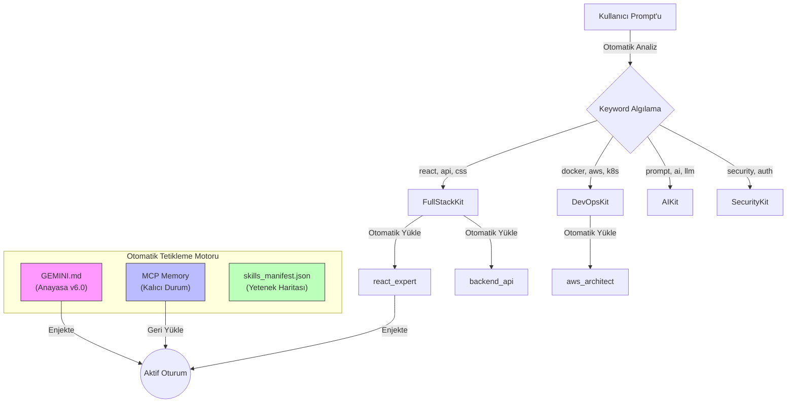

# Agentic Work System v6.0

[](./README.md)
[](LICENSE)
[]()

> **"Yazılı değilse, yoktur."** — *The Anti-Phantom Rule*

Bu depo, gelişmiş "Agentic Coding" (Otonom Kodlama) süreçlerini standartlaştırmak için tasarlanmış eksiksiz bir **Ajan İşletim Sistemi** içerir. Yapay zeka modellerinin bağlamı korumasını, sıkı protokollere uymasını ve pair-programming sırasında geniş bir yetenek kütüphanesini kullanmasını sağlar.

## ✨ v6.0'daki Yenilikler

- 🚀 **Otomatik Tetikleme** - Manuel başlatmaya gerek yok
- 🧠 **MCP Memory Entegrasyonu** - Oturumlar arası kalıcı durum
- 📦 **Akıllı Kit Seçimi** - Anahtar kelimelere göre otomatik skill yükleme
- ⚡ **Sıfır Konfigürasyon** - Sadece prompt yaz, sistem gerisini halleder

---

## 🏗️ Sistem Mimarisi

Sistem, **otomatik tetikleme** ile **"Context Injection"** (Bağlam Enjeksiyonu) modeliyle çalışır. AI, prompt'taki anahtar kelimelere göre kuralları ve yetenekleri dinamik olarak yükler.



---

## 🚀 Kullanım

### Hızlı Başlangıç (v6.0 - Otomatik Tetikleme)

Sadece prompt yaz. **Başlatma komutu gerekmez!**

```
Sen: "Kullanıcı doğrulaması olan bir React dashboard oluştur"
```

AI otomatik olarak:
1. ✅ MCP Memory'den oturum durumunu kontrol eder
2. ✅ Anahtar kelimeleri algılar: `react`, `auth` → `FullStackKit` + `SecurityKit` seçer
3. ✅ Skill'leri yükler: `react_expert`, `auth_patterns`
4. ✅ Çalışmaya başlar

### Anahtar Kelime Tetikleyicileri

| Anahtar Kelimeler | Seçilen Kit | Yüklenen Skill'ler |
|-------------------|-------------|-------------------|
| react, css, database, api, sql | FullStackKit | react_expert, backend_api, database_design |
| docker, aws, kubernetes, terraform | DevOpsKit | aws_architect, docker_optimization |
| prompt, ai, llm, rag, agent | AIKit | prompt_engineering, rag_architecture |
| security, auth, vuln, login | SecurityKit | secops_core, auth_patterns |
| plan, agile, scrum, docs | ManagementKit | project_management, docs_readme |

---

## 📁 Depo Yapısı

```
antigravity-agentic-skills/
├── config/
│   └── skills_manifest.json    # Kit tanımları ve skill eşlemeleri
├── rules/
│   └── GEMINI.md               # Anayasa v6.0 (Otomatik Tetikleme + MCP Memory)
├── skills/                      # 138+ skill modülü
│   ├── react_expert/
│   ├── backend_api/
│   ├── aws_architect/
│   └── ...
└── workflows/
    └── protokol_uygulama.md    # Eski workflow (opsiyonel)
```

---

## 🛠️ Kurulum

1. Depoyu klonla
2. İçeriği yerel `.skillport` dizinine kopyala:
   - Windows: `%USERPROFILE%\.skillport\`
   - macOS/Linux: `~/.skillport/`
3. `rules/GEMINI.md` dosyasını AI asistanının global kurallarına kopyala
4. MCP Memory sunucusunu yapılandır (opsiyonel ama önerilir)

---

## 📚 Yetenek Kütüphanesi (138+ Skill)

### 🌐 FullStackKit
* **Hedef:** Web & Mobil, Veritabanları, API'ler
* **Önemli Skill'ler:** `react_expert`, `backend_api`, `database_design`, `python_pro`, `typescript_advanced`

### ☁️ DevOpsKit
* **Hedef:** Altyapı, Bulut, CI/CD
* **Önemli Skill'ler:** `aws_architect`, `docker_optimization`, `kubernetes_specialist`, `terraform_engineer`

### 🤖 AIKit
* **Hedef:** LLM Entegrasyonu, RAG, Ajanlar
* **Önemli Skill'ler:** `prompt_engineering`, `rag_architecture`, `agent_orchestration`, `langchain_patterns`

### 🛡️ SecurityKit
* **Hedef:** Denetimler, Sızma Testleri
* **Önemli Skill'ler:** `secops_core`, `auth_patterns`, `better_auth`

### 📋 ManagementKit
* **Hedef:** Dökümantasyon, Agile, Planlama
* **Önemli Skill'ler:** `docs_readme`, `project_management`, `scrum_master`

---

## 📜 Lisans

Bu proje MIT Lisansı altında lisanslanmıştır - detaylar için [LICENSE](LICENSE) dosyasına bakın.
